> **Important:** This blog post assumes that you already have some basic experience with programming, shaders, and graphics programming.

Recently I started to become very interested about volumetric cloud rendering, because I very much like the cloud of clouds, especially when they are implemented correctly in games. Realistic volumetric clouds can add a lot of detail to a scene, which is why I was interested to find out more about the process of rendering volumetric clouds and to attempt to create my own volumetric cloud renderer. In this blog post, I will be documenting the process I had to go through to render volumetric and procedural clouds.

Below are images showcasing the end product of my own volumetric cloud renderer. My cloud renderer was written in C++ and is using DirectX 12 to perform the rendering. All code snippets shown in this blog post are written in C++.

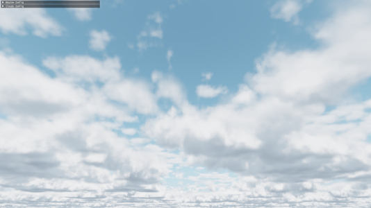

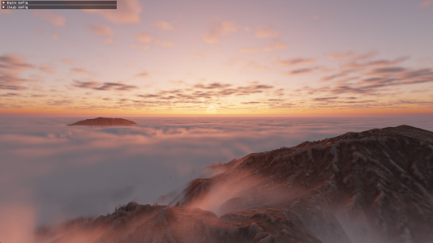

## A Basic Ray-marcher

There are different approaches to rendering volumetric clouds, but all approaches use a method called ray-marching. Ray-marching is a graphics rendering technique where we march along a ray, and take a certain number of sample steps along this ray. Usually ray-marching is used in combination of signed distance fields, but for our purpose of rendering clouds, we will be performing ray-marching using a fixed ray-march step size. Using ray-marching, we can predict the behavior of light and estimate how much light is absorbed by ray-marching through a volume with complex shapes, such as clouds. While ray-marching, it is important to understand that the usual reason for performing a ray-march in volume rendering is to calculate the accumulation of something, such as the light absorption, which can also be viewed as integration.

To begin writing a basic ray-marcher, it is good practice to initially only render a very basic shape. Personally, I choose to render a sphere, because it is very easy to check whether a point is inside of a sphere or not. Below is an illustration of how this basic ray-marcher will function. For each pixel on screen, a ray-marched ray will be traced towards the camera pixel direction. For each step of that ray-march, if the current step is located inside of the sphere, a variable will be incremented to keep track of the volume visibility.

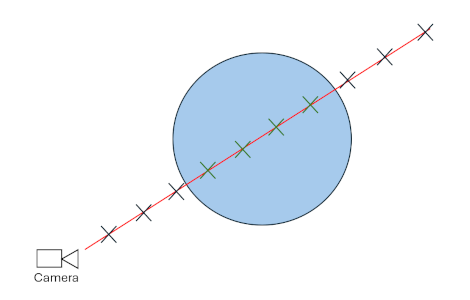

Below is the current code responsible for the basic sphere volume rendering. The code section was written in the HLSL language for DirectX 12.

```cpp
float volumeVisibility = 0.0f;
{
    const int MAX_STEPS = 100;
    const float STEP_SIZE = 0.1f;
    const float VOLUME_DENSITY = 0.05f;
    
    float3 rayPos = cameraPosition;
    float3 rayStep = pixelDirection * STEP_SIZE;
    float rayDist = 0.0f;
    
    for (int i = 0; i < MAX_STEPS; i++)
    {
        // Increment march position
        rayPos += rayStep;
        rayDist += STEP_SIZE;
        
        // Stop ray-marching if ray has hit an object
        if (rayDist > objectDistance)
            break;
        
        // Increment volumeVisibility if current step is located inside of sphere
        if (distance(rayPos, float3(0.0f, 0.0f, -2.0f)) < 2.0f)
            volumeVisibility += FOG_DENSITY;
    }
}
volumeVisibility = clamp(volumeVisibility, 0.0f, 1.0f);

color = lerp(color, 1.0f.xxx, volumeVisibility);
```

The code shown above gives us the following result.

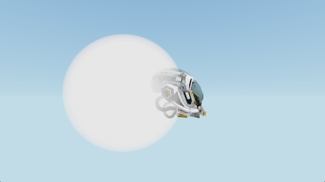

## Creating Cloud Shapes

In real life, there a multiple different types of cloud shapes. The most common cloud shape, which mainly appear at lower altitudes, are called [Cumulus clouds](https://en.wikipedia.org/wiki/Cumulus_cloud). Since cumulus clouds are very common and recognizable clouds, I first decided to try and recreate their shapes for my cloud renderer.

### Which Noise To Use?

Because of my previous coding experiences with procedural terrain generation, I first though that by using Perlin noise, I could generate realistic looking cumulus cloud shapes. Since Perlin noise is often used for procedurally generated objects, there is a lot of existing resources and documentation on Perlin noise. The following image shows the results of Perlin noise.

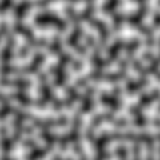

Unfortunately, even though Perlin noise is quite easy to generate, is is not very ideal for procedurally creating cumulus cloud shapes. Cumulus clouds in real life have very billowy and round sub-shapes to them. These round billowy shapes can be seen in the image below.


*Image from: https://d2cvjmix0699s1.cloudfront.net/resources/elephango/resourceFull/clouds_stratus_cumulus_cirrus_10313_full.jpg*

Using Perlin noise, it is very difficult to recreate these round billowed shapes. A more suitable noise for creating the round billowy shapes of cumulus clouds is called Worley noise. Shown below is an image of Worley noise.

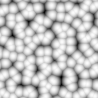

As seen above, Worley noise has the round billowy shapes that we are looking for. Even though Worley noise is very good for adding detail to the clouds, there are still some improvements to be made for creating the main cloud shape. For creating the main cloud shape, the best looking approach is to use something called Perlin-Worley noise, which was mentioned in the [Real-Time Volumetric Cloudscapes of Horizon Zero Dawn talk from Siggraph 2015](https://www.guerrilla-games.com/read/the-real-time-volumetric-cloudscapes-of-horizon-zero-dawn). This noise is a mix of Perlin and Worley noise, where we get the best of both noise algorithms. The reason for wanting to use this unique noise type is because, the Worley noise can make the cloud look a bit too round and too scattered. With the Perlin-Worley noise, we can achieve a more accurate look, where the cumulus clouds have a more blob-like shape and the clouds are less fractures and split up. Below is a comparison between using Perlin-Worley noise and only Worley noise for defining the main cloud shape.

**Only Worley noise:**

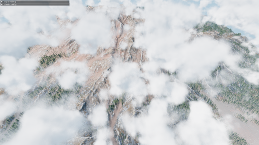

**Perlin-Worley noise:**

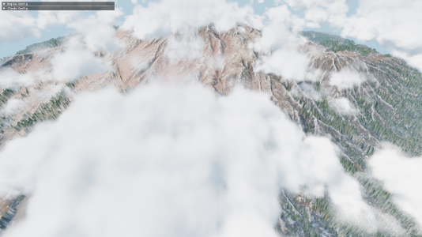

To further increase the detail of the Worley noise, we combine different frequencies of Worley noise together. This is a method called Fractional Brownian motion (fBm). This is something that should also be done with the Perlin-Worley noise. Below is Worley noise shown with (left) and without (right) fBm.

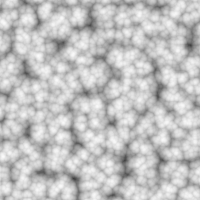


### Generating The Noise

Generating the Worley noises and Perlin-Worley noises required for the cloud rendering is very expensive, therefore, generating the noises realtime in the cloud rendering shader is not an option. Instead, what should be done is to pre-generate the noises and save them to textures. For creating the cumulus cloud shapes, I am currently only using two 3d noise textures.

- **First 3D texture:** It has 4 color channels and a resolution of 128 x 128 x 128. In the first color channel, I store the Perlin-Worley noise, which is used to create the main cloud shape. The other 3 color channels store Worley noise at increasing frequencies, to add the billowy shapes to the clouds.

- **Second 3D texture:** In only has 2 color channels and a resolution of 32 x 32 x 32. The 2 color channels store Worley noise at increasing frequencies. This texture is used to add more finer details to the cumulus clouds.

This a very similar setup for the noise textures as described in the [Real-Time Volumetric Cloudscapes of Horizon Zero Dawn talk from Siggraph 2015](https://www.guerrilla-games.com/read/the-real-time-volumetric-cloudscapes-of-horizon-zero-dawn). The generate the noise textures, I am using a great C++ library called [Fast Noise 2](https://github.com/Auburn/FastNoise2).

### Using The Noise Textures

To ensure a smooth look for the clouds, and avoiding a sudden cutoff to the clouds at the top and bottom of the cumulus cloud layer, it is important to create a falloff / gradient for the cloud densities. For example, since cumulus clouds appear less dense at the top of the cloud compared to the bottom of the cloud, it is important to create a wide density falloff towards the top of the cloud. A correct density falloff for the cloud along the altitude should look something like the image below.


The bright colors represent high cloud densities, and the dark colors represent low cloud densities (no clouds). The gradient at the top is smoother compared to the bottom, because cumulus clouds tend to have flat bottoms, but soft and billowy tops.

In my own cloud render, after sampling the 3d noise textures, I multiply and offset their noise values to get the correct amount of cloud coverage and intensity. Afterwards, I add together all the noise values and multiply them by the density falloff. A simplified code snipped for this can be seen below. This code is located in a `GetCloudDensity()` function, which returns the density of a cloud at a given position. It is important that the returned density remains between the values of 0 and 1.

```cpp
// Calculate the density falloff similar to the image shown above.
float bottomFalloff = saturate((position.y - cloudHeight) * bottomFalloffStrength);
bottomFalloff *= bottomFalloff;  // Square the value to give smoother falloff

float topFalloff = saturate(((cloudHeight + cloudThickness) - position.y) * topFalloffStrength);
topFalloff *= topFalloff;  // Square the value to give smoother falloff

// Combine all noise texture channels together
float combinedNoise = tex1Sample.r + tex1Sample.g + tex1Sample.b + tex1Sample.a + tex2Sample.r + tex2Sample.g;

// Clamp density between 0 and 1 before returning it
return saturate(combinedNoise * bottomFalloff * topFalloff);
```

## Rendering Volumetric Clouds

### Where To Ray-march?

Since ray-marching is quite expensive, it is important to avoid ray-marching in places where there are guaranteed zero clouds. Because of the cloud density falloff I discussed earlier, we know the minimum and maximum heights that clouds can appear. Therefore, before the ray-marching starts, a ray-plane intersection test is performed with two upward facing infinite planes located at the bottom and at the top of the cloud layer. Using the results of these two intersection tests, the origin and the target of the ray-march can be calculated. An illustration of this approach is shown below.

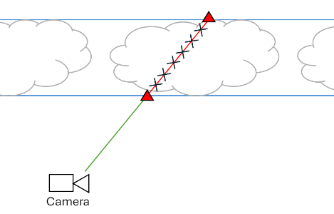

The two blue lines represent the two upward facing infinite planes. After performing a ray-plane intersection test, the two intersection points, shown with the red triangles, are then used as the origin and target for the ray-marching. The ray-marching should only be performed between the two points shown with the red triangles, since that is the only area where cloud could be.

### Improved Cloud Integration

Before adding basic sunlight to the clouds, it is important to first modify the first basic ray-marching approach mentioned in the [A Basic Ray-marcher](#a-basic-ray-marcher) section. The main issue with this approach is that it only allows for one static cloud color. The proper way of doing things while ray-marching through a cloud is to keep track of the cloud transmittance and the cloud energy. The cloud transmittance is responsible for keeping track how much each ray-march step contributes to the final pixel color, and it will always decrease while marching through a cloud. The cloud energy is responsible for keeping track of all of the light energy that scatters towards the camera. This is also called in-scattering, which is responsible for cloud's white color. The cloud energy should accumulate with every ray-march step, but as the cloud transmittance decreases, the cloud energy will accumulate with a smaller amount.

Another new concept to add to our cloud rendering approach is the Beer-Lambert Law. The Beer-Lambert Law describes how light is absorbed while traveling through a substance or a volume. The image below shows the behavior of the Beer-Lambert Law over distance **d**. Mainly the cloud transmittance will be affected by the results of the Beer-Lambert Law.

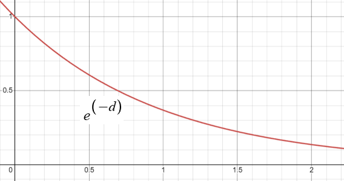

Below is a simplified code snippet for the new volume rendering approach.

```cpp
float3 cloudEnergy = 0.0f.xxx;
float cloudTransmittance = 1.0f;
{
    ...  // Setting up ray-march
    
    for (int i = 0; i < MAX_STEPS; i++)
    {
        // Increment march position
        rayPos += rayStep;
        rayDist += rayStepSize;
        
        // Stop ray-marching if ray-steps have passed the max distance
        if (rayDist > maxRayDist)
            break;
        
        float density = GetCloudDensity(rayPos);

        if (density > 0.0f)
        {
            float3 radiance = sunColor * density;
            // absorption calculated using the Beer-Lambert Law
            float absorption = exp(-absorptionConst * density * rayStepSize);

            // Energy conservative method by Sebastien Hillaire
            cloudEnergy += cloudTransmittance * (radiance - radiance * absorption) / density;
            cloudTransmittance *= absorption;
        }
    }
}
// Calculate final color
color = cloudEnergy + color * cloudTransmittance;
```

While reading through a [talk by Sebastien Hillaire at Siggraph 2016](https://www.ea.com/frostbite/news/physically-based-sky-atmosphere-and-cloud-rendering) on volumetric cloud rendering, I discovered an energy conservative way of accumulating the cloud energy. This new method prevents the clouds from becoming dark at large ray-march step sizes, and bright at small ray-march step sizes.

### Basic Cloud Lighting

To compute clouds being illuminated from a directional light source, such as the sun, the current amount of sun light energy available at each ray-march step has to be calculated. To achieve that, another ray-marched ray is cast towards the light source for each step of the main ray-marched ray. Below is a simple illustration of this.

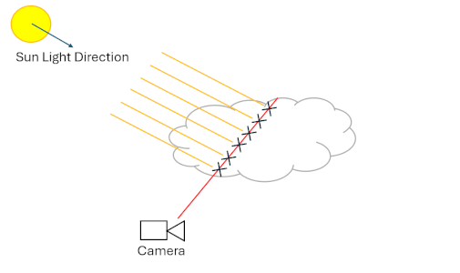

The red line represents the main ray-marched ray, and the yellow lines represent the separate ray-marched rays that are cast for each main ray step towards the light source (sun light). During these light ray-marches, only the accumulated densities need to be kept track of. Using the accumulated densities, the light absorption through the cloud can then be calculated. This is shown in the code snippet below.

```cpp
...  // Setting up light ray-march

float totalLightDensity = 0.0f;
float3 lightEnergy = 0.0f;

for (int j = 0; j < MAX_LIGHT_RAY_STEPS; j++)
{
    lightRayPos += lightRayStep;
    lightRayDist += lightRayStepSize;
    
    if (lightRayDist > maxLightRayDist)
        break;
    
    totalLightDensity += GetCloudDensity(lightRayPos);
}

float lightAbsorption = exp(-lightAbsorptionConst * totalLightDensity * lightRayStepSize);
lightEnergy = sunColor * lightAbsorption;

...

// Set the radiance, shown in the previous code snippet, to lightEnergy
float3 radiance = lightEnergy * density;
```

To ensure that the clouds do not become too dark when all of the sun light is absorbed, it is also good to combine the light energy with an ambient color when setting the "radiance" variable. The ambient color can either be a constant color, or the ambient color can also be calculated and absorbed similarly to the sunLightEnergy. To calculate a realistic looking ambient color, a 3rd ray-marched ray is cast upwards, to determine how much ambient light is absorbed. The code for the ambient ray-marching is almost the exact same as the code for the light ray-marching shown above.

```cpp
...  // Perform light ray-march and ambient ray-march

float ambientAbsorption = exp(-ambientAbsorptionConst * totalAmbientDensity * ambientRayStepSize);
ambientEnergy = ambientColor * ambientAbsorption;

// Radiance is now ambient and light energies combined
float3 radiance = (ambientEnergy + lightEnergy) * density;
```

The benefits of casting this separate ambient ray is that the bottom of the cloud can now get dark if the cloud densities and coverage increase by a lot. These benefits can be seen below.

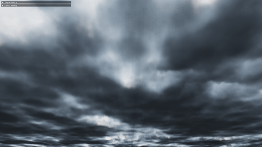

### Advanced Cloud Lighting

While light is traveling through a cloud, it has a higher probability of scattering forward compared to any other direction. This is called Anisotropic scattering. The behavior of Anisotropic scattering can be modelled by a phase function. A commonly used phase function is the **Henyey-Greenstein phase function**. Below is the code implementation of this phase function, which is taken from [Maxime Heckel's Blog Post](https://blog.maximeheckel.com/posts/real-time-cloudscapes-with-volumetric-raymarching/).

```cpp
float HenyeyGreenstein(float g, float mu)
{
    const float gg = g * g;
    return (1.0f / (4.0f * PI)) * ((1.0f - gg) / pow(abs(1.0f + gg - 2.0f * g * mu), 1.5f));
}
```

The **g** variable is just an Anisotropic scattering constant, and the **mu** variable is the dot product between the light direction and the view direction. A small improvement to the phase function, which I read about in the [talk by Sebastien Hillaire at Siggraph 2016](https://www.ea.com/frostbite/news/physically-based-sky-atmosphere-and-cloud-rendering), is to use a two-lobe phase function. A two-lobe phase function ensures that light also has a higher probability of scattering backwards compared to the sides. Below is an implementation of the two-lobe phase function.

```cpp
float TwoLobeHGPhase(float g0, float g1, float mu)
{
    const float phase0 = HenyeyGreenstein(g0, mu);
    const float phase1 = HenyeyGreenstein(g1, mu);

    return phase0 * 0.5f + phase1 * 0.5f;
}
```

In the function shown above, **g0** could be set to a value of **0.6**, and **g1** could be set to a value of **-0.3**.

The Anisotropic scattering of light is responsible for creating the silver lining we often see in clouds, an example of which can be seen below.


*Image from: https://images.squarespace-cdn.com/content/v1/5c54d5a00b77bd8e9ee61b41/1585627191614-2W4UWOFRS3TD48LSHIUG/image-asset.jpeg?format=2500w*

In my code, the phase function was computed only once outside of the main ray-marching loop. The calculated phase value can then multiply the lightEnergy variable.

```cpp
lightEnergy = sunColor * lightAbsorption * phase;
```

While reading through the [Real-Time Volumetric Cloudscapes of Horizon Zero Dawn talk from Siggraph 2015](https://www.guerrilla-games.com/read/the-real-time-volumetric-cloudscapes-of-horizon-zero-dawn), I discovered something called the powdered sugar effect. The powdered sugar effect can be mainly seen in the image below.


*Image from: https://www.angleofattack.com/wp-content/uploads/2023/04/Cumulonimbus-Clouds-scaled.jpg*

When looking at the upper part of the cumulus clouds shown in the image, the cloud's edges appear darker. This is mainly because more light is scattered towards the camera at higher cloud densities compared to the lower cloud densities at the edges of the cloud. The powdered sugar effect was a great addition to my cloud renderer, since it made the shape of clouds easier to see. The powdered sugar look can be estimated using the code shown below.

```cpp
float powderEffect = 1.0f - exp(-powderAbsorptionConst * density * rayStepSize);
float3 radiance = (ambientEnergy + lightEnergy * powderEffect) * density;
```

Usually the entire radiance variable should be multiplied by the powderEffect variable, but in my opinion, the powdered sugar effect looks better if the powderEffect variable only effects the light energy. This ensures that the clouds do not become too dark at certain angles.

## Optimizing The Rendering

### Early Exiting

One of the easiest ways of optimizing the cloud rendering is by breaking the main ray-marching loop early if the contributions of the current ray-march step become too small. Since the contribution is just controlled by the cloudTransmittance variable, I just check if the cloudTransmittance becomes lower than a certain threshold.

```cpp
// Break the loop early if step contributions become very low
if (cloudTransmittance < 0.01f)
{
    cloudTransmittance = 0.0f;
    break;
}
```

### Blue Noise Dithering

Another great way of optimizing the cloud rendering is by dithering between the ray-march steps using random samples from blue noise. The dithering is performed by offsetting the initial starting positions for the ray-marches by random values, to hide the banding that appears with lower ray-march step sizes. The only issue with random values is that they can give a noisy result to the final image. This is where blue noise becomes very useful, since it is only a quasi-random sequence, and it appears to be less noisy. Below is a comparison between completely random white noise and quasi-random blue noise.

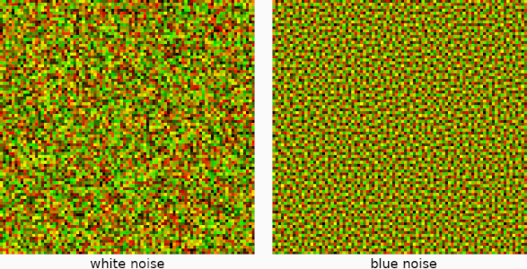

Similar to the Worley-noise, since it is not realistic to generate the blue noise realtime in the cloud rendering shader, I pre-generate the blue noise and store it in a 32 x 32 2D texture with only one color component. The blue noise texture is then sampled, and using the current sampled random value, the ray-march origin is offset along the ray direction. The code for this is shown below.

```cpp
// Outside of the main ray-marching loop, this only needs to be performed once
rayPos -= rayStep * blueNoiseValue;
rayDist -= rayStepSize * blueNoiseValue;
```

The reason for offsetting the ray-march origins the opposite way of the ray-march direction is so that close positions to the camera also get dithered with the clouds.

## Conclusion and Future Additions

During the six weeks of working on this cloud renderer, I learn a lot about volumetric rendering and ray-marching through semi-transparent volumes. Before starting this project, I always found realistic clouds in games very fascinating, but I never had any idea of how such realistic clouds are rendered. While attempting to optimize my cloud renderer, I also learnt some useful things about how the GPU works, mainly because, during this project, it was the first time I used Nvidia Nsight Graphics to find bottlenecks in my cloud rendering shader.

Unfortunately, during these six week, I was not able to implement everything that I wanted to into my cloud renderer. For example, one optimization that can give significant performance improvements is to perform the cloud rendering at a lower resolution compared to the screen resolution. Unfortunately, upscaling can be quite difficult to implement, especially when a cloud is neighboring rasterized content, which is rendered at full resolution. There needs to be careful management of the colors and depths, so that the clouds don't unwillingly appear on top of rasterized content and vice versa.

In the future, I might come back to this project, and polish it even further by, for example, implementing the optimizations I mentioned above. Until then, feel free to read through the amazing sources listed below, which helped me to create this wonderful project!

## Further Reading

- The Real-Time Volumetric cloudscapes of Horizon Zero Dawn - Guerrilla games. (2015, May 13). [https://www.guerrilla-games.com/read/the-real-time-volumetric-cloudscapes-of-horizon-zero-dawn](https://www.guerrilla-games.com/read/the-real-time-volumetric-cloudscapes-of-horizon-zero-dawn)

- Heckel, M. (2023, October 31). Real-time dreamy Cloudscapes with Volumetric Raymarching - The Blog of Maxime Heckel. The Blog of Maxime Heckel. [https://blog.maximeheckel.com/posts/real-time-cloudscapes-with-volumetric-raymarching/](https://blog.maximeheckel.com/posts/real-time-cloudscapes-with-volumetric-raymarching/)

- Blog, C. G. (2020, May 2). Volumetric Rendering Part 2. Chris’ Graphics Blog. [https://wallisc.github.io/rendering/2020/05/02/Volumetric-Rendering-Part-2.html](https://wallisc.github.io/rendering/2020/05/02/Volumetric-Rendering-Part-2.html)

- Schander, T. (2017, August 22). Enscape Cube. Shadertoy. [https://www.shadertoy.com/view/4dSBDt](https://www.shadertoy.com/view/4dSBDt)

- Hillaire, S. (2019, May 16). Physically Based Sky, Atmosphere & Cloud Rendering - Frostbite. Electronic Arts Inc. [https://www.ea.com/frostbite/news/physically-based-sky-atmosphere-and-cloud-rendering](https://www.ea.com/frostbite/news/physically-based-sky-atmosphere-and-cloud-rendering)

- Sebastian Lague. (2019, October 7). Coding Adventure: Clouds [Video]. YouTube. [https://www.youtube.com/watch?v=4QOcCGI6xOU](https://www.youtube.com/watch?v=4QOcCGI6xOU)

- Wedekind, J. (2023, May 3). Procedural volumetric clouds. [https://www.wedesoft.de/software/2023/05/03/volumetric-clouds/](https://www.wedesoft.de/software/2023/05/03/volumetric-clouds/)

---

I hope you enjoyed reading through my article and hopefully you have learnt something new. Feel free to check out the home page of my website, I will continue to post new articles in the future. 

© 2026 David Boyd

## Links

- [Home Page](../)
- [Github](https://github.com/Tusnad30)